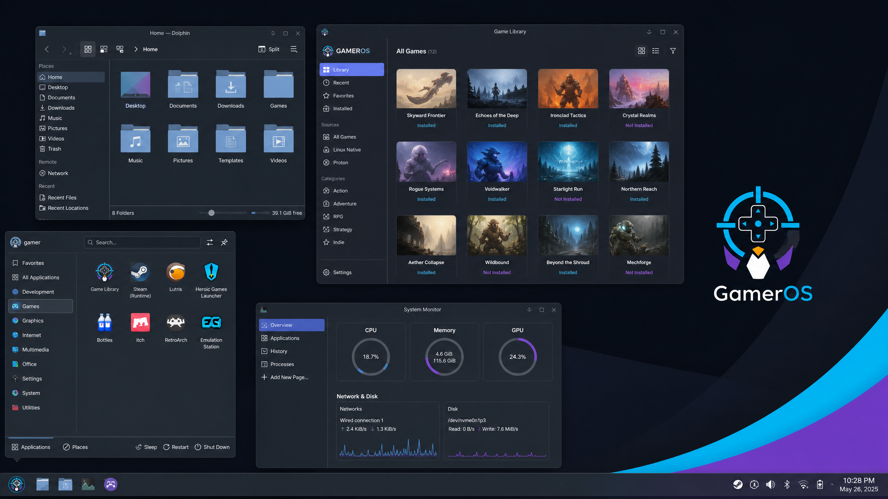
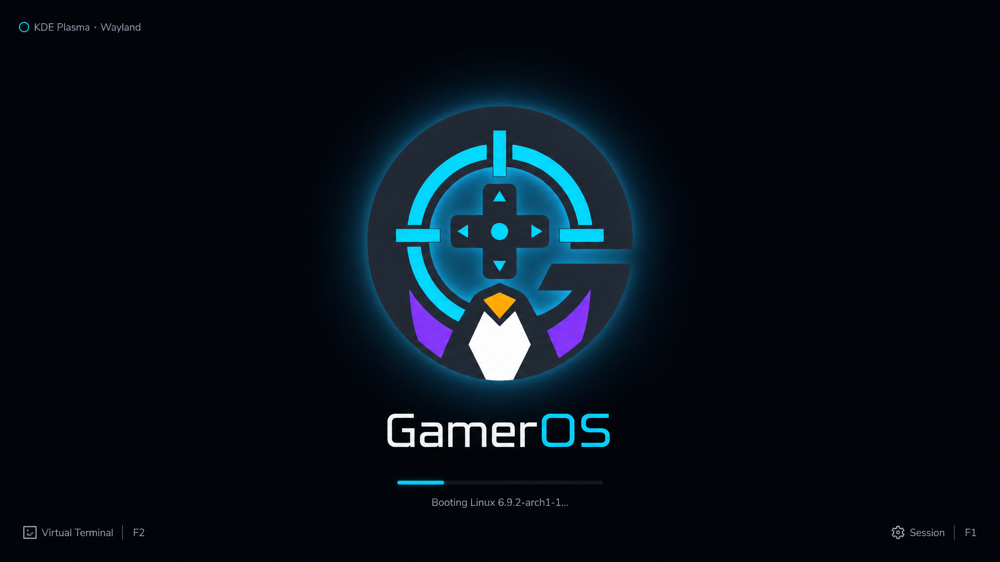
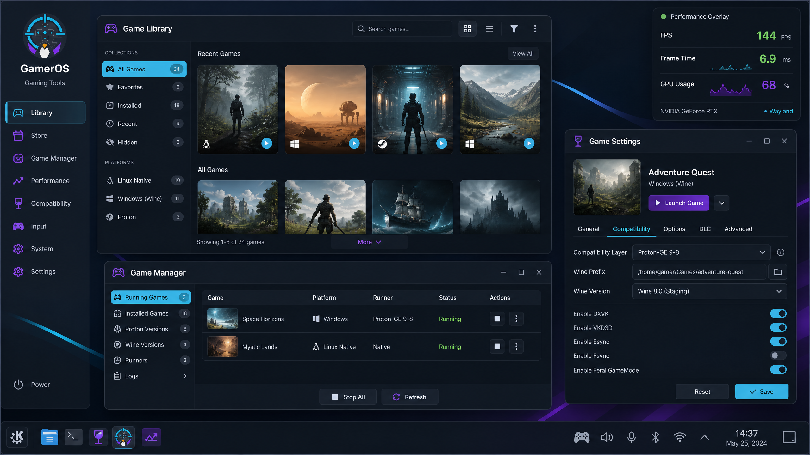

# GamerOS


GamerOS is a gaming-focused Linux desktop built on Ubuntu 24.04 LTS. It uses KDE Plasma as the default desktop, starts with Wayland when the hardware supports it, and keeps an X11 session available for compatibility.

The project is deliberately built from established upstream components. Ubuntu provides the base system and hardware enablement, KDE Plasma provides the desktop, and the Linux graphics stack provides the kernel drivers, Mesa, Vulkan, firmware, and device support.

## Screenshots



*The default KDE Plasma desktop with a dark theme, application launcher, game library, and system monitor.*



*The GamerOS boot and session hand-off screen.*



*Game management, compatibility settings, and performance monitoring in one workspace.*

## Included software

The default image includes Steam, Lutris, Heroic Games Launcher, Discord, Wine, Winetricks, Protontricks, GameMode, MangoHud, GOverlay, OBS Studio, Vulkan tools, PipeWire, Bluetooth support, NetworkManager, and common storage utilities.

The image also includes 32-bit graphics libraries for Steam, Wine, and older games. The installed system runs Ubuntu's driver detection tooling on its first boot and offers the recommended proprietary driver when one is available for the detected hardware.

## System requirements

GamerOS is a 64-bit desktop distribution. The following requirements are practical targets for the current image rather than guarantees for every game or device.

| Component | Minimum | Recommended for gaming |
|---|---|---|
| **Processor** | 64-bit dual-core CPU, approximately 2 GHz or better | Modern 64-bit quad-core CPU or better |
| **Memory** | 4 GB RAM for the installed desktop | 8 GB minimum; 16 GB is preferable for newer games, browsers, and launchers together |
| **Storage** | 25 GB available for the operating system and basic applications | 50 GB or more for the system, compatibility tools, shader caches, and updates; games need additional space |
| **Graphics** | OpenGL-capable Intel, AMD, or NVIDIA GPU with a supported Linux driver | Vulkan-capable GPU with current Mesa or NVIDIA drivers |
| **Display** | 1280×720 or better | 1920×1080 or higher |
| **Firmware** | UEFI or legacy BIOS | UEFI with Secure Boot disabled unless the required third-party drivers are already signed and supported |
| **Network** | Internet connection for updates, Steam, launchers, drivers, and online games | Wired Ethernet or a well-supported Wi-Fi adapter |
| **Installation media** | USB drive with at least 8 GB | USB 3.0 drive with at least 8 GB |

The 4 GB memory target is intended for booting the live session and using the desktop with light applications. It is not a realistic target for modern games. For a comfortable gaming system, use at least 8 GB of RAM, and preferably 16 GB when running a game together with a browser, Discord, recording software, or compatibility tools.

No Linux distribution can guarantee support for every device. NVIDIA hardware, hybrid laptops, unusual Wi-Fi adapters, very recent hardware, RGB peripherals, and some anti-cheat systems may still need additional work. The open-source graphics stack and common firmware are included out of the box, while proprietary drivers are detected after installation when Ubuntu provides a suitable package.

## Download

The public release is hosted on the [Internet Archive](https://archive.org/details/gameros-0.1.0), which provides the complete image, checksum, README, and release notes in one item.

- **ISO image:** [GamerOS-0.1-amd64.iso](https://archive.org/download/gameros-0.1.0/GamerOS-0.1-amd64.iso)
- **SHA-256 checksum:** [GamerOS-0.1-amd64.iso.sha256](https://archive.org/download/gameros-0.1.0/GamerOS-0.1-amd64.iso.sha256)
- **Release notes:** [RELEASE_NOTES.md](https://archive.org/download/gameros-0.1.0/RELEASE_NOTES.md)

The current release is an approximately 4.6 GiB hybrid amd64 ISO. Before writing it to a USB drive, verify that its SHA-256 digest matches the value published in the checksum file.

## Building the image

The supported build host is Ubuntu 24.04 with root access. Building on another distribution may work, but it is not part of the supported workflow.

Install the required tools:

```bash
sudo apt update
sudo apt install -y live-build debootstrap genisoimage syslinux-utils \
  squashfs-tools grub-pc-bin grub-efi-amd64-bin mtools \
  qemu-system-x86 qemu-utils
```

Clone the repository and build the image:

```bash
git clone https://github.com/Igu2012/distro-gamer.git
cd distro-gamer
./build.sh
```

The build script downloads the current Linux packages published by Heroic Games Launcher and Discord, configures the live-build tree, builds an amd64 hybrid ISO, writes a SHA-256 checksum, and places the result in `dist/`.

A complete build needs several gigabytes of free disk space, a reliable network connection, and enough time to download and configure a full KDE desktop with firmware, graphics drivers, 32-bit libraries, Wine, and game launchers.

## Testing in a virtual machine

A quick smoke test can be run with QEMU after the build completes:

```bash
qemu-system-x86_64 \
  -enable-kvm \
  -m 4096 \
  -smp 4 \
  -cdrom dist/GamerOS-0.1-amd64.iso \
  -boot d
```

A virtual machine is useful for checking boot, the live session, package installation, networking, audio, and the installer. It cannot validate real GPU acceleration, Wi-Fi, Bluetooth, suspend, external displays, or proprietary NVIDIA behavior. Those require testing on physical hardware.

## Project status

GamerOS is an early-stage project. The first public image is intended for testing and feedback. Before using it as a primary installation, verify the image checksum and keep a current backup of important data.

The screenshots in this repository are presentation images. They illustrate the intended desktop experience and are not a substitute for testing the ISO on real hardware.

## Licensing

The build scripts, configuration, documentation, and original project assets are released under the MIT License. The ISO contains software from Ubuntu, KDE, Linux, Mesa, Wine, and other upstream projects, each under its own license. Steam, Discord, Heroic Games Launcher, and other proprietary applications remain under their respective terms and are not relicensed by this project.

## Contributing

Issues and pull requests are welcome. Useful contributions include hardware testing, installer reports, package fixes, KDE and Wayland configuration improvements, documentation, reproducible build fixes, and reports from different GPUs and Wi-Fi adapters.

## References

[1]: https://ubuntu.com/download/desktop "Ubuntu Desktop — official download and system information"
[2]: https://kde.org/plasma-desktop/ "KDE Plasma — official desktop page"
[3]: https://wayland.freedesktop.org/ "Wayland — official project page"
[4]: https://help.archive.org/help/uploading-a-basic-guide/ "Internet Archive — Uploading: A Basic Guide"
